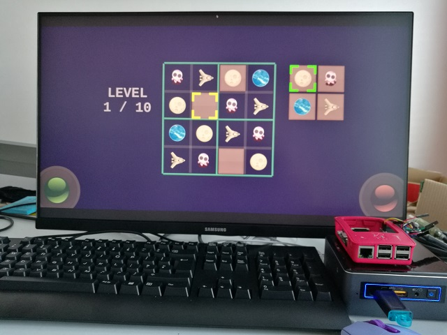
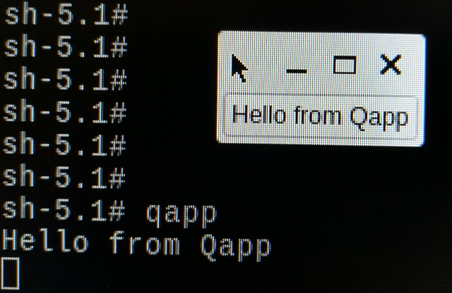
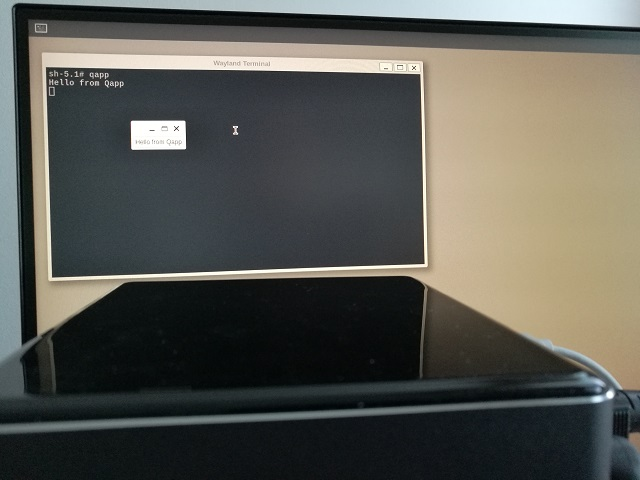
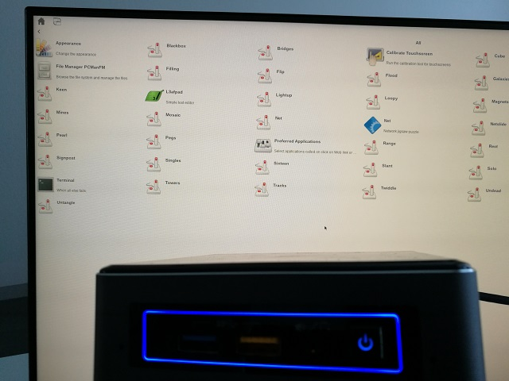
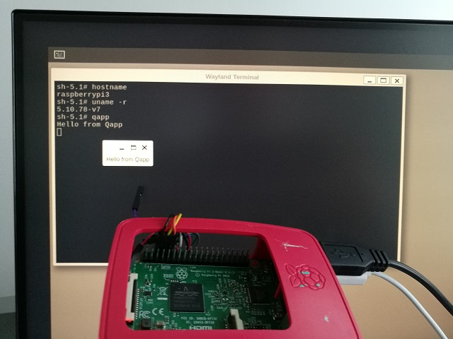
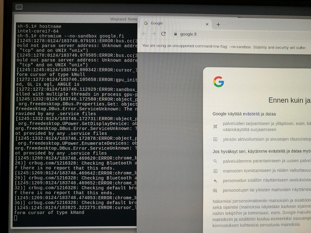
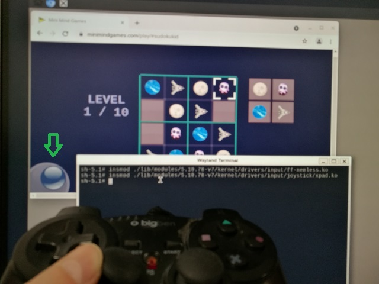

# Webbox - DIY project for web browsing, streaming and gaming

Webbox is a do-it-yourself project to build a lightweight and fully customisable Internet appliance for web browsing, streaming and gaming on Yocto/Linux compatible devices, such as Intel NUC and Raspberrypi.

## Quick start

In the picture is my webbox running on Intel NUC (and Raspberrypi).



This page explains in details the changes made from Yocto/Poky baseline, to build it shortly:
- [Setup Yocto build](#setup-yocto-build)
- Add (relevant) projects below using `git clone` and `bitbake-layers add-layer` commands.
- `~/poky/build/bblayers.conf` should look something like this for Intel NUC.
```
BBLAYERS ?= " \
  /home/ari/poky/meta \
  /home/ari/poky/meta-poky \
  /home/ari/poky/meta-yocto-bsp \
  /home/ari/poky/meta-intel \
  /home/ari/poky/meta-clang \
  /home/ari/poky/meta-webbox \
  /home/ari/poky/meta-openembedded/meta-oe \
  /home/ari/poky/meta-openembedded/meta-python \
  /home/ari/poky/meta-openembedded/meta-multimedia \
  /home/ari/poky/meta-openembedded/meta-networking \
  /home/ari/poky/meta-browser/meta-chromium \
  "
```
- Build [Webbox distro](#webbox-distro)

## Contents

- [Setup Yocto build](#setup-yocto-build)
- [Build Weston image](#build-weston-image)
- [Build Qt test app](#build-qt-test-app)
- [Test on qemu](#test-on-qemu)
- [Test on Intel NUC](#test-on-intel-nuc)
- [Test on Raspberrypi](#test-on-raspberrypi)
- [Chromium browser](#chromium-browser)
- [Startup application](#startup-application)
- [Make it yours](#make-it-yours)
- [Gamepad controller](#gamepad-controller)
- [Audio support](#audio-support)
- [Video resolution](#video-resolution)
- [Webbox distro](#webbox-distro)
- [Enable WLAN](#enable-wlan)
- [Secure WLAN](#secure-wlan)
- [Sleep and wake](#sleep-and-wake)
- [Wake on WLAN](#wake-on-wlan)
- [Remote desktop protocol](#remote-desktop-protocol)
- [Video and audio player](#video-and-audio-player)
- [VLC remote](vlc-remote)
- [VLC custom](vlc-custom)
- [Application development](#application-development)
- [Webbox Manager](#webbox-manager)
- [HTTP server](#http-server)
- [Firewall](#firewall)

## Setup Yocto build

Setup Yocto build for poky, see Yocto Quick Build https://docs.yoctoproject.org/brief-yoctoprojectqs/index.html
```
~/$ sudo apt install gawk wget git diffstat unzip texinfo gcc build-essential chrpath socat cpio python3 python3-pip python3-pexpect xz-utils debianutils iputils-ping python3-git python3-jinja2 libegl1-mesa libsdl1.2-dev pylint3 xterm python3-subunit mesa-common-dev zstd liblz4-tool

~/$ git clone -b honister git://git.yoctoproject.org/poky
~/$ cd poky
```

## Build Weston image

Build weston image to see build setup is good, see images explained at https://docs.yoctoproject.org/ref-manual/images.html
```
# By default machine is qemux86-64 
~/poky$ source oe-init-build-env
~/poky/build$ time bitbake core-image-weston
```

> Briefly, Weston is a wayland referencce implementation and its's about to replace old X11 based GUI.

## Build Qt test app

> You may be interested to use Qt's repo [Boot to Qt](https://doc.qt.io/QtForDeviceCreation/b2qt-index.html). I'm doing this manually just to dig in to more details.

Download Qt (Qt test application is from above).
```
~/poky/build$ git clone git://code.qt.io/yocto/meta-qt6.git ../meta-qt6/
~/poky/build$ bitbake-layers add-layer ../meta-qt6
```

Add Qt test app named as `qapp` in `~/poky/build/conf/local.conf`.
```
# qapp for Qt-based GUI app.
DISTRO_FEATURES:append = " wayland"
#IMAGE_INSTALL:append = " qtwayland" => added with "wayland" feature by "packagegroup-qt6-addons.bb"
IMAGE_INSTALL:append = " qapp"
```

Our image is based on core-image-weston so features should be good but let's check, see https://www.yoctoproject.org/docs/current/mega-manual/mega-manual.html#dev-using-wayland-and-weston
```
# check that we have "wayland" and "weston", then build
~/poky/build$ time bitbake core-image-weston -e |grep ^DISTRO_FEATURES=
```

Build qapp to see it's good and then compete image.
```
~/poky/build$ bitbake qapp
~/poky/build$ bitbake core-image-weston
```

## Test on qemu

Check that qapp is runnable (`nographic` is good to make it faster and on "putty" terminal)
```
~/poky/build$ runqemu tmp/deploy/images/qemux86-64/core-image-weston-qemux86-64.qemuboot.conf
	qemux86-64 login: root
		open weston-terminal and type "qcmd"
			see "Hello from Qcmd" on terminal
				Note: you can exit qemu with "c-a x"
```



## Test on Intel NUC

> I tried before doing any of this and Ubuntu 20.04 image works fine on NUC, so my backup plan is to use Ubuntu, if this Yocto experiment will be a dead end.

Download support for Intel and add `honister` in `meta-intel/conf/layer.conf`.
```
~/poky$ git clone git://git.yoctoproject.org/meta-intel
~/poky/build$ bitbake-layers add-layer ../meta-intel
```

> Patch `meta-intel/recipes-core/ovmf/ovmf_%.bbappend` failed to build so I simply removed it since no need for any secureboot stuff.

Build for i7-machine. Actually, my NUC has i3 but I'm feeling lucky.
```
~/poky/build$ export MACHINE=intel-corei7-64 # or eg. echo 'MACHINE = "intel-corei7-64"' >> conf/local.conf
~/poky/build$ time bitbake core-image-weston
```

Flash the image on USB stick. Note that it will block for a few minutes. I noticed that writing is more reliable if `sync` until "Dirty" is zeroed after inserting USB (before issuing `dd`).
```
~/poky/build$ dmesg -w # insert USB stick to find your /dev/sdX for command below then break ctrl-c
~/poky/build$ sudo dd if=tmp/deploy/images/intel-corei7-64/core-image-sato-dev-intel-corei7-64.wic of=/dev/sdc bs=1M status=progress conv=fsync
```

Eject USB stick from PC and insert it to NUC. To boot NUC from USB use F2 to enter BIOS to change boot order.

Open `weston-terminal` and type `qapp` to see our all mighty test app again (previosly with qemu).



Now you can dd image from USB stick to internal drive so NUC can boot without USB.

> This will wipe out anything on your NUC, skip if unsure.

```
$ dd if=/dev/sdb of=/dev/sda bs=1M
```

I built also `core-image-sato-dev` to see if Yocto's "mobile" look-and-feel would serve my web gaming interests, see the picture below.


 
It looks quite useful out-of-the-box, and it has even some preinstalled games so you can start playing immediately.
 
## Test on Raspberrypi

Download Raspberrypi support with its OE dependencies, see https://meta-raspberrypi.readthedocs.io/en/latest/readme.html
```
~/poky$  git clone -b honister git@github.com:openembedded/meta-openembedded.git
~/poky/build$ bitbake-layers add-layer ../meta-openembedded/meta-oe
~/poky/build$ bitbake-layers add-layer ../meta-openembedded/meta-python
~/poky/build$ bitbake-layers add-layer ../meta-openembedded/meta-multimedia
~/poky/build$ bitbake-layers add-layer ../meta-openembedded/meta-networking

~/poky$ git clone -b honister git://git.yoctoproject.org/meta-raspberrypi
~/poky/build$ bitbake-layers add-layer ../meta-raspberrypi
```

Add features and installs in `build/conf/local.conf`
```
DISTRO_FEATURES:append = " wayland"
CORE_IMAGE_EXTRA_INSTALL = "wayland weston"
```

I have only 200GB space so I removed `~/poky/build/tmp` before building Raspberrypi.
```
~/poky/build$ export MACHINE=raspberrypi3 # or edit conf/local.conf
~/poky/build$ time bitbake core-image-weston
```

Now we can flash the wic-image to SD card (I use Win32DiskImager) and boot Raspberrypi with it.

> The link from `core-image-weston-raspberrypi3.wic.bz2` to actual file was not working so I had to use target rootfs-file of symbolic link, and also with force `bzip2 -d -f` - don't ask why.



With Raspberrypi in the picture, it's really starting to look like an embedded platform. As a side note, I checked also that sato-image was working on my Raspberrypi3.

## Chromium browser

Download chromium (and clang for it) then add to our build.
```
~/poky/build$ git clone -b honister git://github.com/kraj/meta-clang
~/poky/build$ bitbake-layers add-layer ../meta-clang
~/poky/build$ git clone git@github.com:OSSystems/meta-browser.git
~/poky/build$ bitbake-layers add-layer ../meta-browser/meta-chromium
```

> Add dependencies for `meta-openembedded` from Raspberrypi.

Add chromium to `conf/local.conf`, obviously "wayland" version.
```
IMAGE_INSTALL:append = " chromium-ozone-wayland"
```

We want Chromium to `use-egl` and that's already defined in meta-webbox, let's check that's good for our build.
```
bitbake-layers show-appends |grep chromium
```

Our bbappend for chromium was found and parsed. Good. Ready to build the image again - and now with Chromium in build it will take double time.
```
~/poky/build$ time bitbake core-image-weston
```

I was so surprised that it compiled without errors that let's check it really got into our rootfs.

```
bitbake core-image-weston -c devshell
# cd ../rootfs
# find -name chromium
./usr/lib/chromium
./usr/bin/chromium
# exit
```

Chromium is there! I'm surprised and delighted. Can't wait to try it on my NUC.

Let's flash and boot NUC from USB again.



Awesome! That was easier than expected.

> I actually got some kernel panic due to filesystem (ext) failing first, but reflashing fixed. You probably avoid this by calling `sync` after inserting USB before `dd`.

## Start chromium as non-root user

Linux `init` system was good back in 80s, but nowadays `systemd` is used for better control of system services. Modify `build/conf/local.conf` to use systemd.
```
DISTRO_FEATURES:append = " pam systemd"
DISTRO_FEATURES_BACKFILL_CONSIDERED += "sysvinit"
VIRTUAL-RUNTIME_init_manager = "systemd"
VIRTUAL-RUNTIME_initscripts = "systemd-compat-units"
```

You may want to check with Qemu before flashing full image that systemd services are active.
```
~/poky/build$ MACHINE=qemux86-64 bitbake core-image-minimal
~/poky/build$ runqemu tmp/deploy/images/qemux86-64/core-image-minimal-qemux86-64.qemuboot.conf nographic

qemux86-64 login: root
# Check systemctl services are active, also `ps |grep init`, `/sbin/init` and `/proc/1/exe` shall point to systemd
root@qemux86-64:~# systemctl --type=service
```

After flashing and booting NUC, I was genuinely surprised and delighted! The shell prompt was changed from `sh-5.1#` to `sh-5.1$` so the root user problem was indeed solved so we can remove `--no-sandbox` from chromium startup scripts. And also, who wouldn't like to see logs with `journalctl` instead of `cat /var/log/`.
```
sh-5.1$ whoami
weston
```

## Startup application

This is a web console (and not just another linux box) so let's start to web at boot.

This project has a `startapp` recipe to start chromium as a `systemd` service right after weston has started.

Add startapp to the image, like `CORE_IMAGE_EXTRA_INSTALL += "chromium-ozone-wayland startapp"`.

## Make it yours

You can now customize weston GUI for your needs simply by modifying `weston-init.bbappend` and `startapp.sh`.

By default, the build has my preferences:
- Launch icon to open Chromium web browser
- Launch icon for Linux terminal to dig deeper
- Dim screen when idle for 10 minutes
- Screen lock disabled

## Gamepad controller

A webbox shall have a gamepad for gaming, of course.

The Raspberrypi image already has gamepad supported, but it's a kernel module so let's load it (and ff-memless is needed also based on `dmesg`).
```
# insmod lib/modules/5.10.78-v7/kernel/drivers/input/ff-memless.ko
# insmod lib/modules/5.10.78-v7/kernel/drivers/input/joystic/xpad.ko
```

NUC's intel-kernel is not preconfigured with gamepad support, so let's enable it. For details, see Yocto's how to config kernel https://www.yoctoproject.org/docs/latest/kernel-dev/kernel-dev.html#configuring-the-kernel
```
~/poky/build$ bitbake virtual/kernel -c kernel_configme -f
~/poky/build$ bitbake virtual/kernel -c menuconfig
# press '/' to search for "joystic" => and we should find it at "drivers/input/joystic/xpad"
# Set <*> in Joystic interface (Raspberrypi had <M> for module so could fix that to <*> as well)
# Save and exit
~/poky/build$ bitbake linux-intel -c diffconfig
```

It created `fragment.cfg` which we want in our build so add it to your build, similar to `joystic.cfg` in meta-webbox, and check that kernel still builds.
```
~/poky/build$ bitbake-layers show-appends |grep linux-intel # just to check the linux-intel fragment for joystic applies
~/poky/build$ bitbake linux-intel -c cleansstate
~/poky/build$ bitbake linux-intel
```

Then build weston-image, flash it to NUC, plug in a gamepad and reboot NUC. Some of my web games support gamepad so they can be used to check that chromium has now gamepad, e.g. `# chromium --no-sandbox minimindgames.com/en/sudoku-for-kids/`.



In the picture, you can see my old gamepad for Playstation 3 and a green arrow indicating that "virtual stick" is up-right when left-stick of gamepad is pushed up-right.

> If your gamepad is not working, check the generated configuration if something could match to your gamepad. Path to config-file should be something like `~/poky/build/tmp/work/corei7-64-intel-common-poky-linux/linux-intel/5.15.1+gitAUTOINC+bee5d6a159_d7d7ea689c-r0/linux-corei7-64-intel-common-standard-build/.config`.

## Audio support

Web gaming and video streaming is no good without audio. ALSA at least seems to be fine when headset is connected directly to NUC, but there is no audio over HDMI. PulseAudio service should get audio working from all sources.

I want to start with weston-image to avoid getting audio support from some of my other changes. Or, if want to use webbox-image then at least drop some changes in `conf/local.conf`.
```
BBMASK += "qapp chromium-ozone-wayland linux-intel"
```

First check if ALSA and PulseAudio are already in the original weston-based image.
```
~/poky/build$ bitbake -g core-image-weston && cat pn-buildlist | grep -ve "native" | sort | uniq | grep -i 'pulseaudio\|alsa'
```

ALSA seems to be there as expected because headset was working, but PulseAudio is not. Now cross my fingers and try to find out if some brave soul already has made a recipe for us to use.
```
~/poky/build$ bitbake-layers show-recipes pulseaudio
```

Great! A PulseAudio recipe which seems even to be compatible with our build. In recipe the `pulseaudio-server` package seems to have all we need, like PulseAudio ALSA support, systemd service files and some command line tools (see https://wiki.archlinux.org/title/PulseAudio).

Add PulseAudio in `local.conf`.
```
# Pulseaudio with ALSA
DISTRO_FEATURES:append = " pulseaudio"
CORE_IMAGE_EXTRA_INSTALL += "pulseaudio pulseaudio-server"
```

A quick check it's applied before heavy duty build.
```
~/poky/build$ bitbake core-image-weston -e |grep ^IMAGE_INSTALL= |grep -i 'alsa\|pulseaudio'
~/poky/build$ bitbake core-image-weston -e |grep ^DISTRO_FEATURES= |grep -i 'alsa\|pulseaudio'
```

The both seem to enabled now and pulseaudio also got installed in rootfs.
```
runqemu tmp/deploy/images/qemux86-64/webbox-image-qemux86-64.qemuboot.conf nographic
	<login as root>
		$ pactl -h
		$ /usr/bin/pulseaudio -h
	<ctrl-a, x to exit>
```

Time to start build and get a cup of coffee, then flash and boot NUC...

Wonders do happen. There is no need to configure anything and even hotplug works out of box. That actually seems a bit too much magic for me so let's take a closer look.
```
$ systemctl --user status pulseaudio.socket
$ systemctl --user status pulseaudio
$ pactl info
```

PulseAudio services are there snooping for changes and `pactl info` explains that pulseaudio is also detecting hotplug. If you use `pactl` and dis/connect a headset to NUC's stereo plug, "sink" changes from "analog" to "hdmi".

## Video resolution

I have a TV with 4K resolution which is too much for my NUC. It can display HTML pages and even stream but for gaming it's not slick so I want to use lower resolution. In theory, it's easy to change resolution but there are some caveats.

I thought NUC would use HDMI, because it has a HDMI connector. However, resolution did not change after modifying `weston.ini` or `/proc/cmdline`, so I eventually took a look at `/sys/class/drm/*/status` and found only DP-1 to be "connected". Actually NUC product sheet says `Graphics Output: HDMI 2.0a; USB-C (DP1.2)` so I guess that DP part explains this works in `/etc/xdg/weston/weston.ini`.
```
[output]
name=DP-1
mode=1920x1080
```

> If you want to change resolution for good, you should add something like `video=DP-1:1920x1080` in e.g. `/boot/loader/entries/boot.conf` and `mode=current` in `weston.ini`.

## Enable WLAN

You likely have different WLAN configuration from mine, so here are some ideas how you can debug and enable WLAN.
 
In general, Linux networking is based on classic network/interfaces, Network Manager or systemd with networkd. Webbox has `systemd-networkd` already enabled (ie. loaded at boot) which should be good enough.
```
root@intel-corei7-64:~# systemctl status systemd-networkd
```

My Webbox is based on NUC, which seems to have an onboard WLAN interface.
```
root@intel-corei7-64:~# iw dev
phy#0
        Interface wlp58s0
```

By default, NUC seem to be missing WLAN configuration since link is DOWN.
```
root@intel-corei7-64:~# ip link show wlp58s0
4: wlp58s0: <BROADCAST,MULTICAST> mtu 1500 qdisc noop qlen 1000
```

First we need to enable WLAN interface in systemd network configuration, so create a file `/etc/systemd/network/wlan.network` with contents:
```
[Match]
Name=wl*
[Network]
DHCP=ipv4
```

Then restart network manager to see WLAN is now UP. If you have public WLAN (ie. not secure) then WLAN interface should have IP address too.
```
root@intel-corei7-64:~# systemctl restart systemd-networkd
root@intel-corei7-64:~# ip link show wlp58s0
4: wlp58s0: <NO-CARRIER,BROADCAST,MULTICAST,UP> mtu 1500 qdisc noqueue qlen 1000
```

You should now see your SSID with WLAN scan. Also journal tells if you got IP address via DHCP.
```
root@intel-corei7-64:~# iw dev wlp58s0 scan |grep SSID
root@intel-corei7-64:~# journalctl -u systemd-networkd
```

## Secure WLAN

My private WLAN has WPA security enabled so NUC needs to know the password. Also systemd-networkd requires `wpa-supplicant` service for WPA security, see https://wiki.archlinux.org/title/wpa_supplicant.

Enter WLAN password and start wpa_supplicant service.
```
root@intel-corei7-64:~# wpa_passphrase 'T2' > /etc/wpa_supplicant/wpa_supplicant-wlp58s0.conf
# Note: this blocks to wait until you enter your WLAN password
root@intel-corei7-64:~# systemctl start wpa_supplicant@wlp58s0
```

Then check the service status is good, WLAN got IP address and then enable the service at boot.
```
root@intel-corei7-64:~# systemctl status wpa_supplicant@wlp58s0
root@intel-corei7-64:~# ip a
root@intel-corei7-64:~# systemctl enable wpa_supplicant@wlp58s0
```

## Sleep and wake

Webbox should sleep to save power when not in use. You can sleep/suspend Webbow in terminal or over SSH.
```
root@intel-corei7-64:~# systemctl suspend
```

> To quit ssh on terminal after suspending, press '~' and '.'. Wanted to mention as that's not so intuitive.

I usually work on Ubuntu use Webbox to play music and thought that it'd be great to wakeup Webbox directly from Ubuntu. If Webbox was suspended while playing music it should continue playing right there when waken up.

Use `ethtool` to enable Wake on LAN on Webbox, so need to add `CORE_IMAGE_EXTRA_INSTALL += "ethtool"` e.g. in `local.conf`. Then start Webbox, enable WoL and put Webbox in light-sleep with `suspend` command.
```
root@intel-corei7-64:~# ethtool -s eno1 wol g
root@intel-corei7-64:~# ethtool eno1 |grep -i wake
        Supports Wake-on: pumbg
        Wake-on: g
root@intel-corei7-64:~# ip a # get ETH-MAC and ETH-IP for the next step
root@intel-corei7-64:~# systemctl suspend
```

As shown above, my NUC seems to support WakeOnLAN so install `wakeonlan` package on Ubuntu, and try to wake Webbox.
```
~ sudo apt install wakeonlan
~ for i in {1..60}; do
~	sleep 0.5;
~	wakeonlan <ETH-MAC>;
~	ping -c 1 <ETH-IP> -W 1 && break
~ done
```

Webbox should wakeup in a few seconds from suspend.

## Wake on WLAN

If you use WLAN instead of LAN, here is how to enable Wake on WLAN.

Core image already have `iw` installed on Webbox, so enable WoWLAN and suspend (while script just to see alive over SSH).
```
root@intel-corei7-64:~# iw phy0 wowlan enable magic-packet
root@intel-corei7-64:~# iw phy0 wowlan show
WoWLAN is enabled:
 * wake up on magic packet
root@intel-corei7-64:~# systemctl suspend; i=1; while printf '%d' "$((i++))"; sleep 1; do printf ','; done; printf '\n'
```

To wakeup use `wakeonlan` as in "Wake on LAN" but use WLAN interface's IP and EMAC addresses.

> Use `iw list |grep -i wake` to see what wake modes your WLAN supports. Also when experimenting my Webbox WLAN got rarely stuck so could add `ip link set down br0 && ip link set up br0 && systemctl restart systemd-networkd` at wakeup.

## Remote desktop protocol

Weston supports RDP, but unfortunately it (and also VNC) seems to require xorg. That's kind of too much dependencies because I just want some remote control for music player.

If you still want RDP, here is how you get it in image, but you still need to enable xorg.

RDP is a remote desktop standard which Weston and open-embedded already seem to support, as you can find lots of recipes `~/poky/meta-openembedded$ find -name *rdp* `. The server package is `xrdp` and that is what we want.

Add `xdrp` in the image and see rdp (and xorg) is found in weston's packageconfig.
```
~poky/build$ bitbake xrdp
~poky/build$ bitbake -e weston | grep ^PACKAGECONFIG
```

It's there but it's not a simple executable so let's try if devtool could upload xrdp and weston instead of using scp (or the whole image with dd), see https://docs.yoctoproject.org/ref-manual/devtool-reference.html
```
~poky/build$ bitbake xrdp -e |grep ^WORKDIR=
~poky/build$ devtool modify xrdp
~poky/build$ devtool build xrdp
~poky/build$ devtool deploy-target xrdp root@<webbox-ip-address> # run `ip a` on webbox for IP, such as 192.168.x.y
# upload weston too
```

Login to Webbox and modify some to get it running.
```
$ ssh root@<ip-address>
$ touch /etc/xrdp/rsakeys.ini
$ vi /etc/xrdp/xrdp.ini
	crypt_level=none
```

Then quit weston and restart with RDP. I'm guessing it should work now but I haven't tested it.
```
$ mkdir /run/user/0 && chmod 700 /run/user/0 && export XDG_RUNTIME_DIR=/run/user/0
$ weston --backend=rdp-backend.so --width=1024 --height=768 --socket=wayland-1
$ weston --backend=rdp-backend.so --width=1024 --height=768 --socket=wayland-1 --rdp4-key=/home/root/key.pem 
$ systemctl restart xrdp
```

## Video and audio player

Browser can be used to play video but a dedicated player gives better control. VLC has been my favorite player since 90s.

Add  VLC in the image `build/conf/local.conf`, and accept the licences appropriate for your use (probably not all commercial ones like here).
```
CORE_IMAGE_EXTRA_INSTALL += "vlc"
LICENSE_FLAGS_WHITELIST = "commercial" # see https://docs.yoctoproject.org/singleindex.html
```

> You need also multimedia layer `bitbake-layers add-layer ../meta-openembedded/meta-multimedia/`.

To use VLC on terminal open `nvlc`, see https://wiki.videolan.org/Documentation:Alternative_Interfaces/ and https://wiki.videolan.org/Documentation:Modules/ncurses/ for shortcut commands.
```
intel-corei7-64:/home/weston$ nvlc <url-file-or-folder>
```

Here is a list of some nice music streams to get started building your favorite playlists https://wiki.secondlife.com/wiki/Music_streams

## VLC remote

VLC has a bunch of interfaces, see https://wiki.videolan.org/Interfaces/
```
weston@intel-corei7-64:~$ vlc -I rc
[cli] lua interface error: Error loading script /usr/lib/vlc/lua/intf/cli.luac: ../../vlc-3.0.12/share/lua/modules/common.lua:3: attempt to call a nil value (global 'module')`
```

Type `help`, `play`, `stop`, etc. to see that you can control VLC from terminal.

> VLC is quite picky about LUA versions, https://wiki.videolan.org/Contrib_Status so should downgrade LUA to 5.2. Find the recipe at https://git.congatec.com/yocto/meta-openembedded/-/commit/d2ec4eef07c977e2b30142b4e141436fea295eb1#960a7301583d1cbedb6f01cdc37d353885cb3228 and add `PREFERRED_VERSION_lua = "5.2%"` in `local.conf`.

Next try to control VLC programmatically over a unix-socket by opening VLC with `rc-unix` parameter. VLC is clever with playlist format so it can be a folder where you keep your music or for example an URL "http://66.225.205.8:8030/" to start streaming immediately.
```
weston@intel-corei7-64:~$ cvlc -I oldrc --rc-unix=vlc.sock <playlist>
```

Open another terminal on Webbox and start `python3`.
```
>>>  import socket; sock = socket.socket(socket.AF_UNIX); sock.connect('/home/weston/vlc.sock')
>>> sock.send("\nstop\n".encode())
>>> sock.send("\nplay\n".encode())
```

It couldn't work any better and with unix-socket it's easy to integrate with whatsoever.

But, there is always a but... VLC with `oldrc` simply denies to work for me when I try to start it from a script to background as a systemd-service. End of story with "official" VLC remotes.

## VLC custom

I have tried to use many of VLC remote control interfaces and they all suck. Let's code something better with https://wiki.videolan.org/LibVLC_Tutorial

On development host you'll need libvlc, obviously.
```
$ sudo apt-get install libvlc-dev
```

VLC custom features:
- UI control over HTTP and command line
- Select to play a playlist not individual songs (UI simplified)
- Recall the latest playlist and song (shuffle button not needed)
- When started continue playing from the latest song (play button not needed)
- Loop playlist on background indefinitely (repeat button not needed)
- Let modify a playlist by removing just the currently playing song
- Completely release audio when stop playing
- Some audio controls like volume up/down

You can find code in `webbox_http_vlc.c`. By default, it loads playlists from `/media/music`, so ount your music playlists there, e.g. from USB stick:
```
$ mkdir /media/music
$ mount /media/music /dev/sdb1
$ ls /media/music
Classical/ Jazz/ Xmas/
```

## Application development

Webbox functionality is easy to extend with both script and native programs.

Linux shell scripts are the most obvious way to code.
```
~$ echo 'Hello world!'
```

Python is available if you added layer `meta-openembedded/meta-python`.
```
python3 -c 'print("Hello world!")'
```

For native languages you need to install a compiler on Webbox image, or use a cross-compiler on your host computer like this, see https://www.yoctoproject.org/docs/latest/sdk-manual/sdk-manual.html
```
~/poky/build$ MACHINE=intel-corei7-64 bitbake webbox-image -c populate_sdk 
~/poky/build$ tmp/deploy/sdk/poky-glibc-x86_64-webbox-image-corei7-64-intel-corei7-64-toolchain-3.4.1.sh
```

After SDK is "populated", you can source cross-compilers toolchain to get environment variables initialized, e.g.
```
~$ source /opt/poky/3.4.1/environment-setup-corei7-64-poky-linux
```

Create a hello program, CC it, use `file` to see it's compiled for correct machine, then upload to Webbox where you can run it.
```
~$ cat << EOF > hello.c
#include <stdio.h>
int main() {
   printf("Hello world!\n");
   return 0;
}
EOF

# compile for host
~$ gcc hello.c -o hello
~$ file hello
~$ ./hello

# cross-compile for Webbox
~$ $CC hello.c -o hello
~$ file hello
~$ scp hello root@192.168.0.164:
```

Yocto cross-compiling demystified, but Hello world is still magical.

> Python was already working for VLC remote control so you might ask why not continue with Python. I might be wrong (obviously), but the next excercises will require some kernel bindings and a generic C sounds better choice than trying to find kernel bindings for a specific Python version.

## Webbox Manager

Webbox Manager provides Webbox user interfaces to handle request from a user.

If you want to build your own manager from scratch, see https://www.yoctoproject.org/docs/current/mega-manual/mega-manual.html#new-recipe-testing-examples

Yocto mega-manual is missing `cmake` based build which actually should be the default, so here is an example for CMake to keep you on a good road.

Create source files `nano main.c`.
```
#include <stdio.h>

int main() {
   printf("Webbox Manager!\n");
   return 0;
}
```

Create cmake file `nano CMakeLists.txt`.
```
project(WebboxManager)
cmake_minimum_required(VERSION 3.0)

add_executable(WebboxManager main.c)
```

Generate cmake, build sources and run WebboxManager program on host to see all should be good.
```
cd build
cmake -DCMAKE_BUILD_TYPE=Debug .. # debug build on host only, for target simply "cmake .."
make
./WebboxManager
```

Then create a new Yocto recipe for WebboxManager, see https://www.yoctoproject.org/docs/latest/sdk-manual/sdk-manual.html, and modify `workspace/recipes/webbox-manager/webbox-manager.bb` with SRCs and/or something to install in the image.

My WebboxManager is included in this `meta-webbox` layer. It's easy to customize with Yocto's `devtool` utility.
```
~/poky/build$ devtool modify webbox-manager
# if you started from scratch: devtool add webbox-manager ~/webbox-manager/
```

You get the stuff in `workspace/sources/webbox-manager/`, which is easy to `cmake` for host as explained above, or to `devtool build` and `deploy-target` to Webbox.
```
devtool build webbox-manager
devtool deploy-target webbox-manager root@192.168.0.164
```

If you started from scratch, final step would be to add the package in the image `IMAGE_INSTALL += "webbox-manager"`.

I bet embedded development has never been easier. Open terminal on Webbox and find `which WebboxManager` to run it. I bet embedded development has never been easier.

## HTTP server

I want to control Webbox remotely from my mobile phone (and desktop) using a web browser, which means that I need some sort of web server running Webbox.

First you obviously want to check that you can connect Webbox from your remote machine. Yocto meta-openembedded/meta-webserver seems to have a bunch of HTTP servers to pick from at https://layers.openembedded.org/layerindex/branch/master/layer/meta-webserver/

If you have added python meta-layer, you can test connectivity with python's builtin webserver. Simply start a server and connect to Webbox with a browser using any device.
```
ip a # IP address to connect, or "localhost" if using browser on Webbox, of course
python3 -m http.server
```

I'm planning to use HTTP just to send commands to Webbox, such as to start a music playlist, and an HTTP server with CGI support could indeed run server side scripts on HTTP requests.

However, I want more like full control over Webbox instead of full features http server, so I'm build HTTP server from scratch. You can find HTTP server code in "webbox_http.c" to get started with your experiments. It's a very simple HTTP server code that listens for client connections, hosts Webbox HTML based UI and handles incoming HTTP request.

Webbox image starts HTTP server listening on port :80 so you can connect to it with any browser, or simply use address `localhost` on Webbox's browser.

## Firewall

My Webbox resides within LAN and I have a router between LAN and Internet. If you connect Webbox to Internet without router or enable "virtual server" on the router to enable external SSH access, you must have a firewall to block unwanted incoming traffic.

For systemd we can use `firewalld` to configure what traffic is allowed so add it in the image.
```
CORE_IMAGE_EXTRA_INSTALL += "firewalld"
```

Firewalld is a userland app so it needs some kernel support, see https://firewalld.org/documentation/concepts.html. Check that Netfilter is enabled. Nftables is the future but Iptables is good enough for my needs so I'll use it because it's enabled by default and firewalld supports the both.
```
~/poky/build$ bitbake virtual/kernel -e |grep ^B=
# go to build dir printed and search what we have already in enabled for kernel
~/poky/build$ grep NETFILTER .config
~/poky/build$ grep IPTABLES .config
~/poky/build$ grep NF_TABLES .config
```

The kernel has Iptables so change firewalld to use that instead of nftables.
```
root@intel-corei7-64:~# vi /etc/firewalld/firewalld.conf # FirewallBackend=iptables
root@intel-corei7-64:~# systemctl restart firewalld
root@intel-corei7-64:~# systemctl status firewalld
```

Firewall is now active and we can create the rules to block unwanted visitors, e.g.:
```
root@intel-corei7-64:~# firewall-cmd --list-all
root@intel-corei7-64:~# firewall-cmd --permanent --add-source=192.168.0.0/24
```

## Webbox distro

Finally, it's kind of dirty to modify `local.conf` extensively. This project has configuration files containing the changes needed, so you can use them to build Webbox image.
```
~/poky/build$ git clone git@github.com:minimindgames/meta-webbox.git ../meta-webbox/
~/poky/build$ bitbake-layers add-layer ../meta-webbox
~/poky/build$ DISTRO=webbox MACHINE=intel-corei7-64 bitbake webbox-image
```

Now, you should have something like `tmp/deploy/images/intel-corei7-64/webbox-image-intel-corei7-64.wic` to flash on NUC.

## Conclusion

We have now a Linux based webbox with Chromium browser.

Webbox is great for streaming at https://www.youtube.com/, playing your favorite music and also for HTML5 games e.g. at https://itch.io/games/platform-web.

Enjoy your home brewed Webbox!

## Tips and tricks

Webbox device tips:
- Update `date -s "2022..."` if your device has no time to handle https-pages, e.g. in Chromium

Yocto tips:
- GEMU is very slow - patience is a virtue
- Monitor you disk space with `df` to not run out of disk space (200GB is barely enough for one MACHINE)
- Building image on my P710 (with 56 cores) takes a bit less than an hour from scratch

Linux tips:
- Images are big so `dd` takes time, `cat /proc/meminfo |grep Dirty` to see progress, `sync` frequently
- Best Linux tip ever is to searh history with `ctrl-r`

Bitbake tips:
- https://elinux.org/Bitbake_Cheat_Sheet

Windows tips:
- Best Windows tip ever is to install Ubuntu with Windows Subsystem for Linux, on Windows command prompt `wsl --install`
